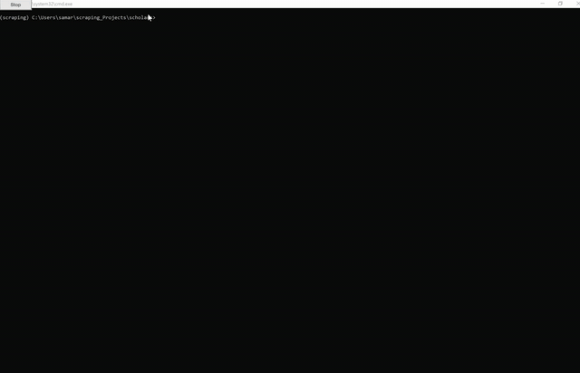

# webScraping
**Web Scraper** automatically scrapes  https://scholars.duke.edu/ to output academic articles and conference papers, readership statistics, and relevant information based on keyword input.

## Getting Started

These instructions will get you a copy of the project up and running on your local machine for development and testing purposes. See deployment for notes on how to deploy the project on a live system.

### Prerequisites

Things needed to successfully run the file:

```
Scrapy
Selenium
Docker
Splashy
Driver (in this case we used Chrome Driver Version 81)
```

## Video Walkthrough
Here's a sample walkthrough of the code running and scrapping all the 50 articles and corresponding altmetric information  for each of the 18 pages (around 900 articles in total). 



Note: The searched term chosen was "Machine Learning" and the code automatically selected Academic Articles and Conference Papers only. The speed of the video is also slowed down.

## Output
The output can be a .json, .csv, or SQ3Lite among other options. Information gathered included:

```
Name of Article
Authors
Published Date
DOI
Abstract
Link to Full Article
Readership Statisitics 
... etc. 
```

## Challenges
The main challege was using Selenium as the website was built with Javascript as well as issues regarding pagination (the next button at the bottom of the website did not take you to the next page, but rather to the next set of page numbers that are to be displayed). In addition, a lot of relevant information was present that needed to be scraped and thus it was quite a time consuming task. Finally, the altmetric page was 2 levels deeper than the original page and that part had to be navigated. 

## Credit
- [Scrapy](https://scrapy.org/)
- [Selenium](https://www.selenium.dev/)
- [Modern Web Scraping with Python using Scrapy Splash Selenium](https://www.udemy.com/)
